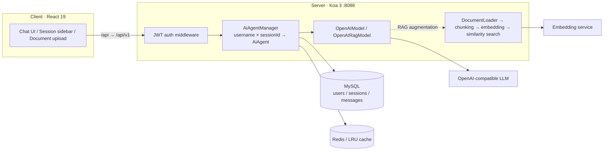

# Yukino Chatbot

> A full-stack AI chat application with **RAG-powered knowledge-base Q&A** — built on React 19 × Koa 3 × LangChain. Multi-user, multi-session, and streaming out of the box.

## Features

- **Streaming responses** — SSE token-by-token delivery with real-time Markdown rendering for a smooth typing experience
- **RAG knowledge-base Q&A** — upload `.md` / `.txt` / `.json` documents; they are automatically chunked and embedded. Switch to the `openai-rag` model to get answers grounded in your private documents
- **Multi-user & multi-session** — email registration / login with JWT authentication; each user maintains an isolated set of sessions and chat history
- **Persistent storage** — users, sessions, and messages are stored in MySQL; full conversation context is restored on server restart
- **Resilient caching** — Redis is preferred; the server automatically falls back to an in-process LRU cache when Redis is unavailable, so it runs with zero external dependencies
- **i18n & theming** — Chinese / English locales, with light / dark / system theme options
- **OpenAI-compatible endpoints** — both the chat model and the embedding model are configured via `baseURL`, so any OpenAI-compatible provider can be plugged in

## Tech Stack

| Layer    | Technologies                                                                                                            |
| -------- | ----------------------------------------------------------------------------------------------------------------------- |
| Frontend | React 19 · Vite 8 · TypeScript · Tailwind CSS 4 · TanStack Query / Form · Jotai · React Router 7 · i18next · Streamdown |
| Backend  | Node.js · Koa 3 · @koa/router · TypeScript · Rollup · tsx                                                               |
| AI       | LangChain · ChatOpenAI · OpenAIEmbeddings · MemoryVectorStore · RecursiveCharacterTextSplitter                          |
| Storage  | MySQL (Knex) · Redis (ioredis) · LRU cache fallback                                                                     |
| Auth     | JWT (jsonwebtoken) · Zod request validation                                                                             |

## Architecture



**Streaming request flow**: the client issues a `fetch` POST → the auth middleware validates the Bearer token → `AiAgentManager` looks up (or creates) an `AiAgent` keyed by `username + sessionId` → if the `openai-rag` model is selected, the user's uploaded documents are retrieved by similarity search and the prompt is augmented → the LLM streams back tokens → chunks are pushed to the frontend via SSE (`data: ...` / `data: [DONE]`) → the complete reply is asynchronously persisted to MySQL.

### Project Layout

```
.
├── client/                     # React frontend
│   └── src/
│       ├── pages/              # Login / Register / Chat
│       ├── hooks/queries/      # TanStack Query wrappers (sessions, history, streaming, upload…)
│       ├── stores/             # Jotai atoms (theme, language, model selection)
│       ├── i18n/               # zh / en locale bundles
│       └── components/         # UI primitives, Markdown renderer, settings bar
└── server/                     # Koa backend
    └── src/
        ├── router/             # /user · /ai · /file routes
        ├── controller/         # Request validation & response assembly
        ├── service/            # Business logic
        ├── dao/                # Data access layer
        ├── ai/                 # AiModel / AiAgent / AiAgentManager / model factory
        ├── rag/                # Document loading, chunking, vector retrieval, RAG prompt building
        ├── middleware/         # JWT authentication
        ├── db/                 # MySQL · Redis · LRU cache
        └── config/             # Environment configuration & logging
```

## Getting Started

### Prerequisites

- Node.js ≥ 20.19
- pnpm ≥ 9
- MySQL 8.x
- Redis (optional — the server falls back to an in-memory LRU cache when unavailable)
- An OpenAI-compatible LLM / embedding service

### 1. Install dependencies

```bash
pnpm install
```

### 2. Configure environment variables

```bash
cd server
cp .env.example .env
```

Edit `.env` as needed — at minimum, fill in the database and model service settings:

```dotenv
# MySQL
MYSQL_HOST=localhost
MYSQL_PORT=3306
MYSQL_USER=root
MYSQL_PASSWORD=pass
MYSQL_DB=yukino_chatbot

# LLM (any OpenAI-compatible endpoint)
OPENAI_MODE_NAME=qwen3
OPENAI_BASE_URL=https://your-llm-endpoint/v1
OPENAI_API_KEY=sk-xxx

# Embeddings (required for RAG)
EMBEDDING_MODEL=nomic-embed-text
EMBEDDING_BASE_URL=https://your-embedding-endpoint/v1
EMBEDDING_API_KEY=sk-xxx
```

> No manual schema setup required — the `users` / `sessions` / `messages` tables are created automatically on server startup.

### 3. Run in development

From the repository root, start both frontend and backend concurrently:

```bash
pnpm dev
```

- Frontend: Vite dev server (default `http://localhost:5173`), with `/api` proxied to `http://localhost:8088/api/v1`
- Backend: `tsx watch` with hot reload, listening on `0.0.0.0:8088`

### 4. Build & run in production

```bash
pnpm build                # Build frontend and backend concurrently
cd server && pnpm start   # node dist/main.js
```

## Configuration Reference

| Variable                                                         | Default                        | Description                                                              |
| ---------------------------------------------------------------- | ------------------------------ | ------------------------------------------------------------------------ |
| `APP_HOST` / `APP_PORT`                                          | `0.0.0.0` / `8088`             | Server bind address and port                                             |
| `REDIS_ENABLED`                                                  | `true`                         | Falls back to the LRU cache when disabled or unreachable                 |
| `REDIS_HOST` / `REDIS_PORT` / `REDIS_PASSWORD` / `REDIS_DB`      | `127.0.0.1` / `6379` / — / `0` | Redis connection settings                                                |
| `MYSQL_*`                                                        | —                              | MySQL connection settings (host / port / user / password / db / charset) |
| `JWT_KEY` / `JWT_ISSUER` / `JWT_SUBJECT` / `JWT_EXPIRE_DURATION` | —                              | JWT signing key and expiration (hours)                                   |
| `DOCS_DIR`                                                       | `./docs`                       | Global documents directory                                               |
| `EMBEDDING_MODEL` / `EMBEDDING_BASE_URL` / `EMBEDDING_API_KEY`   | `nomic-embed-text`             | Embedding service settings                                               |
| `OPENAI_MODE_NAME` / `OPENAI_BASE_URL` / `OPENAI_API_KEY`        | `qwen3`                        | Chat model settings                                                      |

## API Reference

All endpoints are prefixed with `/api/v1`. Except for the user endpoints, every request requires `Authorization: Bearer <token>`.

| Method | Path                                              | Description                                                 |
| ------ | ------------------------------------------------- | ----------------------------------------------------------- |
| POST   | `/user/register`                                  | Register (email + password); returns a token                |
| POST   | `/user/login`                                     | Login (username + password); returns a token                |
| GET    | `/ai/chat/get-user-sessions-by-username`          | List the current user's sessions                            |
| POST   | `/ai/chat/create-session-and-send-message`        | Create a session and ask a question (single response)       |
| POST   | `/ai/chat/create-session-and-send-message-stream` | Create a session and ask a question (SSE streaming)         |
| POST   | `/ai/chat/send-message-2-session`                 | Follow-up question in an existing session (single response) |
| POST   | `/ai/chat/send-message-stream-2-session`          | Follow-up question in an existing session (SSE streaming)   |
| POST   | `/ai/chat/get-chat-history-list`                  | Retrieve the chat history of a session                      |
| POST   | `/file/upload`                                    | Upload a RAG document (multipart, field name `file`)        |

The `model_type` field in request bodies accepts:

- `openai` — plain chat
- `openai-rag` — knowledge-base Q&A grounded in the current user's uploaded documents

## RAG Knowledge-Base Q&A

1. After logging in, upload documents on the chat page (`.md` / `.txt` / `.json` supported). Files are renamed by CRC32 hash and stored under `uploads/<username>/`
2. Switch the model to `openai-rag` when asking questions
3. The server recursively splits the documents in that user's directory (chunk size 1000 / overlap 200), builds an in-memory vector store, retrieves the top-5 similar chunks, and injects them into the prompt before invoking the LLM

> If no documents have been uploaded, `openai-rag` gracefully degrades to plain chat instead of failing.

## Scripts

Run from the repository root:

| Command       | Description                                         |
| ------------- | --------------------------------------------------- |
| `pnpm dev`    | Start frontend and backend dev servers concurrently |
| `pnpm build`  | Build frontend and backend concurrently             |
| `pnpm lint`   | ESLint (client) + Biome (server) checks             |
| `pnpm format` | Prettier (client) + Biome (server) formatting       |

## License

[MIT](./LICENSE) © hangtiancheng

---

<details>
<summary>Appendix: RAG sample documents for testing</summary>

The following documents can be used to verify RAG retrieval (upload them, then ask "What kind of game is 原人?" or "What does 哈基米 do?"):

**原人.md**

```md
# 原人

原人是由哈基米自研的一款开放世界冒险 RPG。你将在游戏中探索一个被称作瓦特乐的幻想世界。在这广阔的世界中，你可以踏遍七国，邂逅性格各异、能力独特的同伴，与他们一同对抗强敌，踏上寻回血亲之路；也可以不带目的地漫游，沉浸在充满生机的世界里，让好奇心驱使自己发掘各个角落的奥秘……直到你与分离的血亲重聚，在终点见证一切事物的沉淀
```

**哈基米.md**

```md
# 哈基米（也称为马哈鱼）

哈基米，也称为马哈鱼，成立于 2020 年，致力于为用户提供美好的、超出预期的产品与内容。哈基米多年来秉持技术自主创新，坚持走原创精品之路，围绕原创 IP 打造了涵盖漫画、动画、游戏、音乐、小说及动漫周边的全产业链
```

</details>
